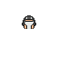
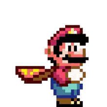
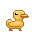

  

<h1 align="center">
    🌟 CuteCompanion! 🌟
</h1>

  
  

  
  

<h3 align="center">
  <i>A tiny friend for your desk, your work, your study sessions, and your late-night gaming.</i>
</h3>

---

### The App

**CuteCompanion** is a small, friendly animated sprite that lives in your Mac’s menu bar. A quiet, comforting presence to keep you company while you focus, create, grind, or procrastinate (most probably).

No chaos, no noise, just a tiny buddy who moves when you move and stays with you through everything you do on your computer.

  

---

## 🧑‍💻 What is CuteCompanion??? 

This is a **digital desk companion**:
A little animated friend who moves when you move your cursor around, stays in the top bar while you work, and brings just the right amount of liveliness to your screen without interrupting your flow or CPU usage. 

They’re there when you’re…

* Studying late
* Working through a tough project
* Gaming for hours (touch some grass)
* Organizing your life
* Or simply vibing on your desktop

**CuteCompanion** is designed to make your computer feel a little less empty and a lot more friendly.

---

## 🎮 Key Features

### 1. **Swap companions anytime** 

Choose the companion that fits your mood, or meet a new one when you need a different kind of energy.

### 2. **Pixel-art animations** 

Each companion has expressive, smooth, handcrafted animations that feel alive but never distracting.

### 3. **“Stop the Cuteness”**

Need a break?
One click and your companion will ~~die~~ rest until you call them back.

---

## 🌱 Why Have a Companion?

Because **YES**. 

# Download it and discover all possibile companions!

Coming Soon on App Store for free...

(Currenty under review)

## Author

Me 

---

**Legal**

- **Privacy Policy:** [Privacy Policy](https://pietrosaveri.github.io/CuteCompanion/SupportSites/privacypolicy.html)
- **Support:** [Support & Contact](https://pietrosaveri.github.io/CuteCompanion/SupportSites/support.html)

